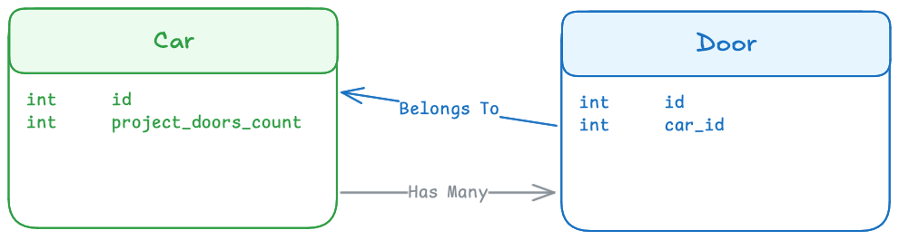

# Laravel Projectable Aggregates

[](https://packagist.org/packages/romanzipp/laravel-projectable-aggregates)
[](https://packagist.org/packages/romanzipp/laravel-projectable-aggregates)
[](https://packagist.org/packages/romanzipp/laravel-projectable-aggregates)
[](https://github.com/romanzipp/Laravel-Projectable-Aggregates/actions)

## What

Laravel Projectable Aggregates is a package that allows you to **easily storage aggregate values like counts, sums, averages**, etc. in your models eliminating the need to **calculate these values on the fly** (with `withCount`, `withStum`, `withAvg`, etc.).

## Installation

```bash
composer require romanzipp/laravel-projectable-aggregates
```

## Terminology

#### 🟢 Consumers 

Consumers hold the projectable aggregate database field. This is the model which otherwise would calculate the relationship fields via `withCount`, `withStum`, `withAvg`, etc.

#### 🔵 Providers

Providing models provide (duh) the aggregate values for the consumer. Think of the provider to exist many times for one consumer.



## Usage

Let's continue with the example of a `Car` model with `Door` models. We want to store the Doors count in the Car's `project_doors_count` field.

### 1. Add a Projection Field to DB

```php
new class() extends Migration
{
    public function up()
    {
        Schema::create('cars', function (Blueprint $table) {
            $table->id();
            $table->unsignedInteger('project_doors_count')->default(0);
        });
    }
}
```

### 2. Update your Models

#### 🟢 Car (Consumer)

The consumer model will attach the [`ConsumesProjectableAggregate`](src/Attributes/ConsumesProjectableAggregate.php) attribute to the provider relation.

```php
use romanzipp\ProjectableAggregates\Attributes\ConsumesProjectableAggregate;
use romanzipp\ProjectableAggregates\ProjectionAggregateType;

class Car extends Model
{
    #[ConsumesProjectableAggregate(
        projectionAttribute: 'project_doors_count',   // <- Name of the projection field in the database
        projectionType: ProjectionAggregateType::TYPE_COUNT
    )]
    public function doors(): HasMany
    {
        return $this->hasMany(Door::class);
    }
}
```

#### 🔵 Door (Provider)

The provider model will attach the [`ProvidesProjectableAggregate`](src/Attributes/ProvidesProjectableAggregate.php) attribute to the consumer relation.

```php
use romanzipp\ProjectableAggregates\Attributes\ProvidesProjectableAggregate;
use romanzipp\ProjectableAggregates\ProjectionAggregateType;

class Door extends Model
{
    #[ProvidesProjectableAggregate(
        projectionAttribute: 'project_doors_count',   // <- Name of the FOREIGN projection field in the database
        projectionType: ProjectionAggregateType::TYPE_COUNT
    )]
    public function car(): BelongsTo
    {
        return $this->belongsTo(Car::class);
    }
}
```

### 3. Register the Projection Aggregates

In order to listen to model events issued by the provider models, you need to register the consumer models in the `boot` method of your `AppServiceProvider`.

```php
use romanzipp\ProjectableAggregates\ProjectableAggregateRegistry;

class AppServiceProvider extends ServiceProvider
{
    public function boot()
    {
        $registry = app(ProjectableAggregateRegistry::class);

        $registry->registerConsumers([
            Car::class,
        ]);

        $registry->registerProviders([
            Door::class,
        ]);
    }
}
```

## Documentation

### Aggregate Types

There are three types of aggregates that can be calculated:

- `ProjectionAggregateType::TYPE_COUNT`: Counts the number of related models.
- `ProjectionAggregateType::TYPE_SUM`: Sums the related models' values.
- `ProjectionAggregateType::TYPE_AVG`: Averages the related models' values.

> [!IMPORTANT]  
> In order to use the aggregate types `TYPE_SUM` and `TYPE_AVG`, you need to specify the target attribute of the relationship.
> ```php
> #[ProvidesProjectableAggregate(
>     projectionAttribute: 'project_price_average',
>     projectionType: ProjectionAggregateType::TYPE_AVG,
>     targetAttribute: 'price',                          // <- Attribute of the related model to average/sum up
> )]
> ```

## Testing

This repository contains a [Lando](https://lando.dev) configuration file that can be used to run the tests on your local machine.

```bash
lando start
```

```
lando phpunit
```

## License

The MIT License (MIT). Please see [License File](LICENSE.md) for more information.
