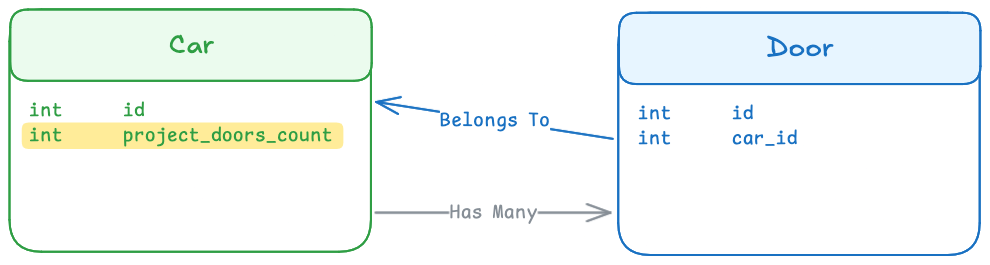

# Laravel Projectable Aggregates

[](https://packagist.org/packages/romanzipp/laravel-projectable-aggregates)
[](https://packagist.org/packages/romanzipp/laravel-projectable-aggregates)
[](https://packagist.org/packages/romanzipp/laravel-projectable-aggregates)
[](https://github.com/romanzipp/Laravel-Projectable-Aggregates/actions)

## What

Laravel Projectable Aggregates is a package that allows you to **easily storage aggregate values like counts, sums, averages**, etc. in your models eliminating the need to **calculate these values on the fly** (with `withCount`, `withStum`, `withAvg`, etc.).

## Installation

```bash
composer require romanzipp/laravel-projectable-aggregates
```

## Usage

### Terminology

#### Consumers 🟢

Consumers hold the projectable aggregate database field. This is the model which otherwise would calculate the relationship fields via `withCount`, `withStum`, `withAvg`, etc.

#### Providers 🔵

Providing models provide (duh) the aggregate values for the consumer. Think of the provider to exist many times for one consumer.



## Testing

This repository contains a [Lando](https://lando.dev) configuration file that can be used to run the tests on your local machine.

```bash
lando start
```

```
lando phpunit
```

## License

The MIT License (MIT). Please see [License File](LICENSE.md) for more information.
